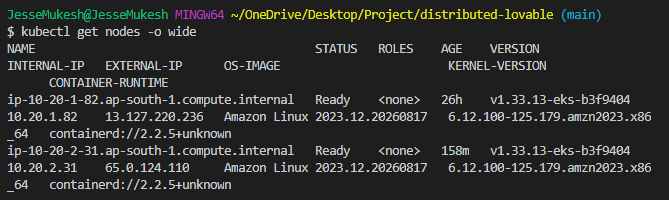
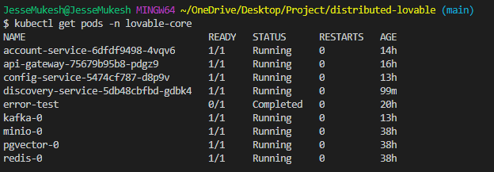
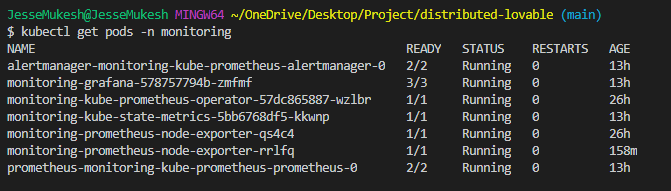
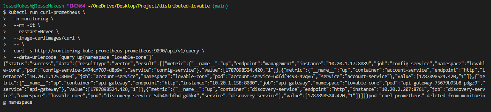
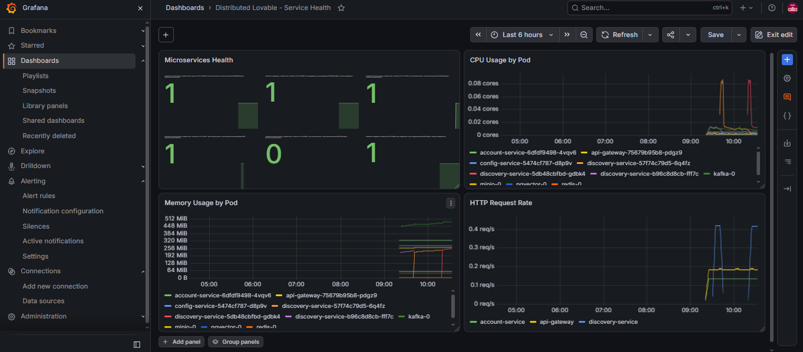

# Distributed Lovable -- AWS DevOps & SRE Project

A cloud-native distributed application deployed on **AWS EKS** with
**Kubernetes, Docker, GitHub Actions, Amazon ECR, Prometheus, Grafana,
and Prometheus alerting**.

------------------------------------------------------------------------

## Architecture

The application is deployed on Amazon EKS and consists of Spring Boot
microservices and supporting infrastructure components.

``` text
                         GitHub
                           |
                           v
                    GitHub Actions
                           |
                  +--------+--------+
                  |                 |
                  v                 v
             Maven Build       Docker Build
                                    |
                                    v
                              Amazon ECR
                                    |
                                    v
                              Amazon EKS
                                    |
              +---------------------+---------------------+
              |                     |                     |
              v                     v                     v
        API Gateway          Account Service       Config Service
              |                     |                     |
              +---------------------+---------------------+
                                    |
                                    v
                            Discovery Service
                                    |
              +---------------------+---------------------+
              |          Supporting Services              |
              |                                             |
              | Kafka | Redis | PostgreSQL/pgvector | MinIO |
              +---------------------------------------------+

                         Monitoring
                            |
                  +---------+---------+
                  |                   |
              Prometheus           Grafana
                  |
             Alertmanager
```

------------------------------------------------------------------------

## Technology Stack

  Category                  Technologies
  ------------------------- -------------------------------
  Cloud                     AWS
  Container Orchestration   Amazon EKS, Kubernetes
  Containerization          Docker
  CI/CD                     GitHub Actions
  Container Registry        Amazon ECR
  Application               Java 21, Spring Boot
  Build                     Maven
  Service Discovery         Netflix Eureka
  Messaging                 Apache Kafka
  Cache                     Redis
  Database                  PostgreSQL / pgvector
  Object Storage            MinIO
  Monitoring                Prometheus
  Visualization             Grafana
  Alerting                  PrometheusRule / Alertmanager
  Operating System          Amazon Linux
  Version Control           Git / GitHub

------------------------------------------------------------------------

## Microservices

The application currently contains:

-   **API Gateway**
-   **Account Service**
-   **Config Service**
-   **Discovery Service**

Supporting infrastructure:

-   **Kafka**
-   **Redis**
-   **PostgreSQL / pgvector**
-   **MinIO**

------------------------------------------------------------------------

## AWS Infrastructure

The project runs in AWS Region:

``` text
ap-south-1 (Mumbai)
```

Primary infrastructure includes:

-   Amazon EKS
-   EC2 worker nodes
-   Amazon ECR
-   VPC networking
-   IAM
-   Kubernetes networking and services

### EKS Cluster

``` text
distributed-lovable-dev-eks
```

------------------------------------------------------------------------

## Kubernetes Deployment

Application workloads run in the:

``` text
lovable-core
```

namespace.

Monitoring workloads run in:

``` text
monitoring
```

namespace.

### Application Workloads

The `lovable-core` namespace contains:

-   API Gateway
-   Account Service
-   Config Service
-   Discovery Service
-   Kafka
-   Redis
-   PostgreSQL / pgvector
-   MinIO

### EKS Nodes



------------------------------------------------------------------------

## CI/CD Pipeline

GitHub Actions automates application build and deployment.

### Deployment Flow

``` text
Developer Push
      |
      v
GitHub
      |
      v
GitHub Actions
      |
      +--> Maven Build
      |
      +--> Docker Build
      |
      +--> Push Image to Amazon ECR
      |
      +--> Configure EKS Access
      |
      +--> Update Kubernetes Deployment
      |
      +--> Wait for Rollout
      |
      +--> Verify Deployment
```

Separate deployment workflows are configured for the major
microservices.

### CI/CD Features

-   Automated Maven build
-   Docker image creation
-   Git SHA image tagging
-   Amazon ECR image push
-   AWS authentication using IAM
-   Kubernetes deployment
-   Rolling update
-   Rollout validation
-   Deployment verification

------------------------------------------------------------------------

## Kubernetes Workloads

Current application workloads can be verified using:

``` bash
kubectl get pods -n lovable-core
```

Example project state:



The project also runs a Kubernetes monitoring stack:



------------------------------------------------------------------------

## Monitoring & Observability

Prometheus collects application and Kubernetes metrics.

Grafana provides dashboards for visualization.

### Application Monitoring

ServiceMonitors are configured for:

-   API Gateway
-   Account Service
-   Config Service
-   Discovery Service

Spring Boot Actuator exposes Prometheus metrics through:

``` text
/actuator/prometheus
```

### Prometheus Service Health

The application services are monitored using the Prometheus `up` metric.

``` promql
up{namespace="lovable-core"}
```

Example healthy result:

``` text
api-gateway        1
account-service    1
config-service     1
discovery-service  1
```



------------------------------------------------------------------------

## Grafana Dashboard

The Grafana dashboard provides an application-focused monitoring view.

It includes:

-   Microservices health
-   CPU usage by pod
-   Memory usage by pod
-   HTTP request rate



------------------------------------------------------------------------

## Prometheus Alerting

PrometheusRule resources are configured for application availability.

Current application availability alerts include:

-   API Gateway Down
-   Config Service Down
-   Discovery Service Down

Example alert expression:

``` promql
up{job="config-service"} == 0
```

The alerts are configured with a delay before firing to avoid
unnecessary alerts from short-lived failures.

------------------------------------------------------------------------

## Health Checks

Kubernetes health probes are configured for application services where
required.

The project uses:

-   Startup probes
-   Readiness probes
-   Liveness probes

Example:

``` text
Startup Probe
     |
     v
Application starts
     |
     v
Readiness Probe
     |
     v
Pod receives traffic
     |
     v
Liveness Probe
     |
     v
Detect unhealthy application
```

------------------------------------------------------------------------

## Deployment Validation

Deployments are validated using Kubernetes rollout status:

``` bash
kubectl rollout status deployment/<service> -n lovable-core
```

The deployed image can be verified with:

``` bash
kubectl get deployment <service> \
  -n lovable-core \
  -o jsonpath='{.spec.template.spec.containers[0].image}{"\n"}'
```

Prometheus can also be used to validate application availability:

``` promql
up{namespace="lovable-core"}
```

------------------------------------------------------------------------

## Reliability & SRE Practices

The project demonstrates practical DevOps and SRE practices including:

-   Kubernetes health probes
-   Readiness and liveness checks
-   Startup probes
-   Rolling deployments
-   Automated rollout validation
-   Prometheus monitoring
-   Grafana dashboards
-   Service-level health monitoring
-   Prometheus alerting
-   Containerized workloads
-   Automated CI/CD
-   Immutable Docker image tagging using Git SHA

------------------------------------------------------------------------

## Repository Structure

``` text
distributed-lovable/
│
├── api-gateway/
├── account-service/
├── config-service/
├── discovery-service/
│
├── k8s/
│   ├── services/
│   └── monitoring/
│
├── .github/
│   └── workflows/
│
├── screenshots/
│   ├── eks-nodes.png
│   ├── application-pods.png
│   ├── monitoring-pods.png
│   ├── prometheus-health.png
│   └── grafana-dashboard.png
│
└── README.md
```

------------------------------------------------------------------------

## Key Kubernetes Resources

### ServiceMonitors

``` text
account-service
api-gateway
config-service
discovery-service
```

### PrometheusRules

``` text
api-gateway-alerts
config-service-alerts
discovery-service-alerts
```

------------------------------------------------------------------------

## Project Highlights

-   Deployed a distributed Spring Boot application on AWS EKS.
-   Containerized microservices using Docker.
-   Automated application delivery using GitHub Actions.
-   Used Amazon ECR for container image management.
-   Implemented Kubernetes rolling deployments.
-   Integrated Prometheus and Grafana for observability.
-   Implemented application availability alerts.
-   Added Kubernetes health probes.
-   Added rollout validation and deployment verification.
-   Built a practical cloud-native DevOps/SRE environment on AWS.

------------------------------------------------------------------------

## Project Status

**Completed**

Core application deployment, CI/CD, Kubernetes orchestration,
monitoring, observability, and alerting have been implemented.
